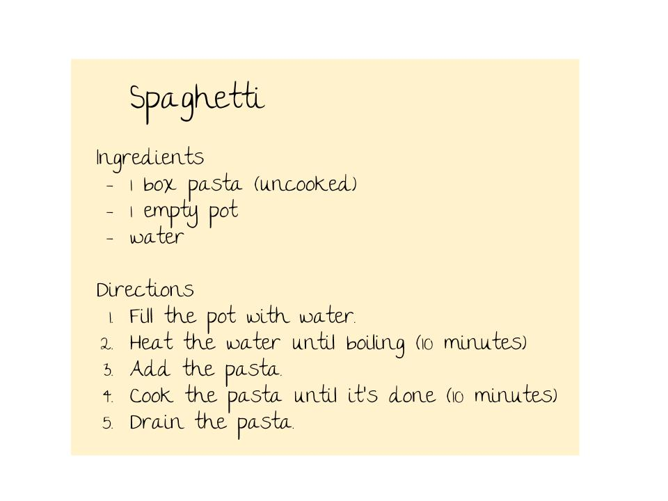
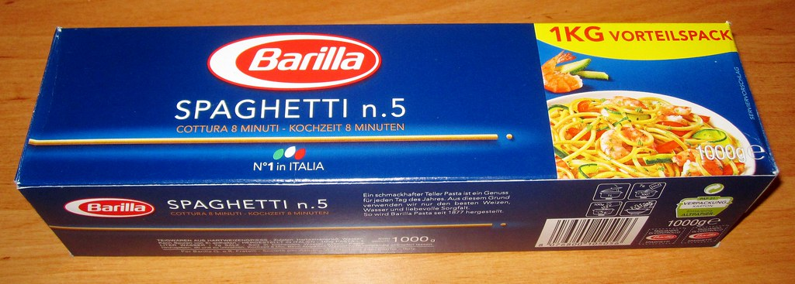
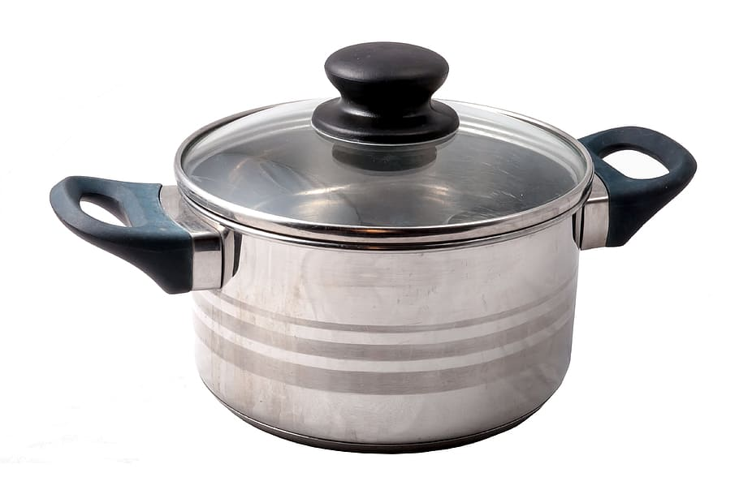
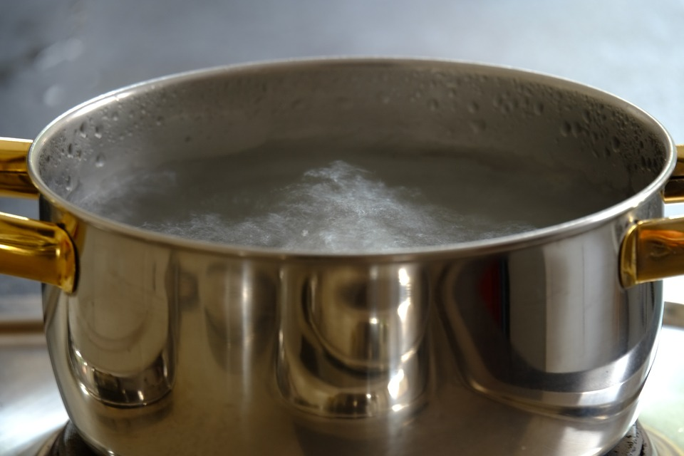
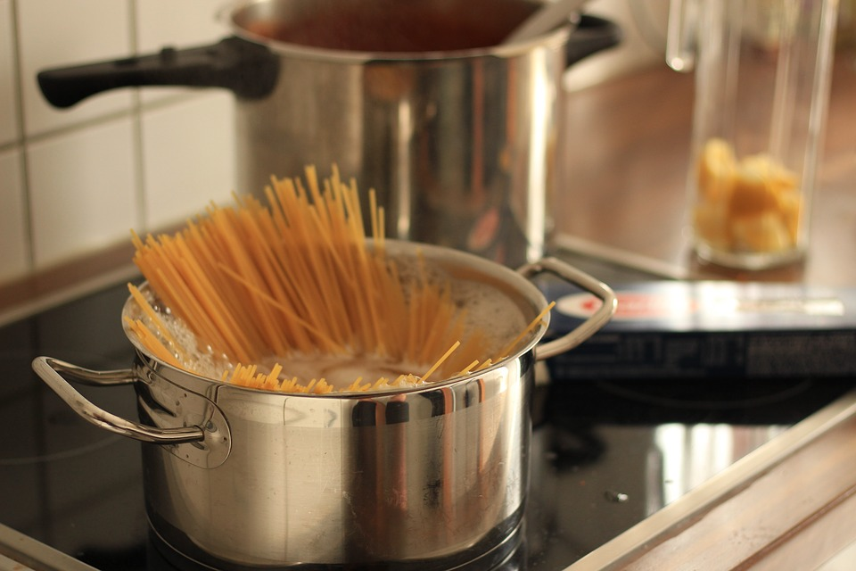
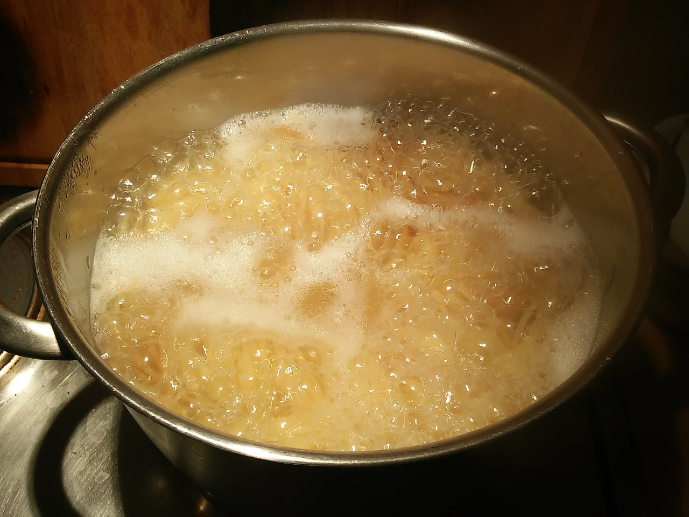
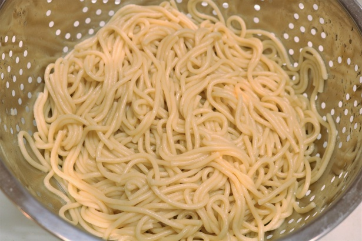

```{r setup, include=FALSE}
library(learnr)
source("spaghetti_functions.R")
library(dplyr)
library(gradethis)
tutorial_options(exercise.checker = gradethis::grade_learnr)
```


## Introduction
### Background
Behold, the pipe. The above image is a famous painting by Rene Magritte, the namesake of the [magrittr ](https://cran.r-project.org/web/packages/magrittr/vignettes/magrittr.html) package.

magrittr introduces several piping operators. The most common of them is `%>%` -- this pipe is so common, in fact, that it has been incorporated into [dplyr](https://dplyr.tidyverse.org/), which is where many people first encounter it.

### What does %>% do?
You can't smoke the `%>%`. It's more like a utility pipe, a form of transportation for your data objects. The pipe takes the result of the operation on its left and feeds it into the next function on its right.

You can string together multiple pipes in a row. In fact, that's what's so cool about it. The pipe allows your code to be read _linearly_. It can be helpful to think of `%>%` as standing for something close to "...and then..."

### Why is %>% useful?
By translating `%>%` as "and then," we are making an analogy to language. Whenever we describe a task to someone, we break it down into sequential steps: do one thing, then another, then another.

Turns out, we can talk to computers this way too. 

## Learning to cook
### Recipes
Recipes are the ultimate stepwise instructions. You start with some things, mix them together, and then keep adding other things or otherwise modifying the mixture.



In order to see how useful pipes can be, let's cook some spaghetti.


### Gathering ingredients
You've probably cooked spaghetti before. If you're like some people I know, then maybe spaghetti is the only thing you've ever cooked. 

But have you ever cooked spaghetti using *pipes*? I didn't think so.

To start out, I'm going to give you a box of pasta (`box`) and a pot (`pot`) to cook it in. Go ahead and take a look at your materials to see what you're working with.

 
```{r explore_materials, exercise = TRUE}

```

<div id="explore_materials-hint">
**Hint:** Look at your box. How is it `str`uctured? What's in it? Now do the same with the pot: you wouldn't want to start cooking if there was anything inside...
</div>

### Prep work
Now, let's fill the pot with water.
```{r fill_pot, exercise = TRUE}
# Change this code so that it uses a pipe. 
# Remember to reassign your result to the `pot` object!
pot <- fill(pot)
```

<div id="fill_pot-hint">
**Hint:** (take your) `pot` _and then_ `fill()` (it)... 
</div>

```{r fill_pot-solution}
pot <- pot %>% fill()
```

```{r prepare-potwater}
# setup chunk for exercises that require the pot to be filled with water.
pot <- pot %>% fill()
```

### 
Now we have to heat the water. 10 minutes should be plenty.

```{r heat_water, exercise = TRUE, exercise.setup = "prepare-potwater"}
# Change this code so that it uses a pipe.
pot <- cook(pot, what = "water", minutes = 10)

```

<div id="heat_water-hint">
**Hint:** The thing that gets "piped" becomes the first argument in the next function. You can specify additional arguments normally without worrying about the first one.
</div>

```{r heat_water-solution}
pot <- pot %>% cook(what = "water", minutes = 10)
```

```{r prepare-hotwater}
# setup chunk for exercises that require hot water in the pot.
pot <- pot %>% fill() %>% cook(what = "water", minutes = 10)
```

### A twist: piping to an argument other than the first
Now we want to add the pasta to the pot. But take a look at the syntax for the `add` function in the exercise below. We need to pipe `pot` to the `to` argument because we want to add pasta _to_ the pot. But `to` is not the first argument!

Luckily, we can use `.` to explicitly specify which argument we want to pipe to. It would be redundant if we were piping to the first argument, but it would still work! Try it here.
```{r add_pasta, exercise = TRUE, exercise.setup = "prepare-hotwater"}
# Change this code so that it uses a pipe.
pot <- add(what = "pasta", from = box, to = pot)
```

<div id="add_pasta-hint">
**Hint:** Try replacing `pot` with `.` in `to = pot`. You can also leave off the `to =`.
</div>

```{r add_pasta-solution}
pot <- pot %>% add(what = "pasta", from = box, to = .)
```


### Cooking the pasta

```{r prepare-pasta}
# setup chunk for exercises that require raw pasta in the hot water.
pot <- pot %>% fill() %>% cook(what = "water", minutes = 10) %>% add("pasta", box, .)
box <- df(ingredient = "air", cooked = 0)
```

Okay, you know the drill now. Cook the pasta using a pipe. 10 minutes should do it...
```{r cook_pasta, exercise = TRUE, exercise.setup = "prepare-pasta"}
# Change the following code so that it uses a pipe.
pot <- cook(pot, what = "pasta", minutes = 10)
pot
```

```{r cook_pasta-solution}
pot <- pot %>% cook(what = "pasta", minutes = 10)
```


### Draining the pasta

```{r prepare-cooked_pasta}
# setup chunk for exercises that require raw pasta in the hot water.
pot <- pot %>% fill() %>% 
  cook("water", 10) %>% 
  add("pasta", box, .) %>% cook("pasta", 10)
box <- df(ingredient = "air", cooked = 0)
```

Finally, drain the pot.
```{r drain_pasta, exercise = TRUE, exercise.setup = "prepare-cooked_pasta"}
# Change the following code so that it uses a pipe.
pasta <- drain(pot)
pasta
```

```{r drain_pasta-solution}
pasta <- pot %>% drain()
```


## The whole process... piped!
Now you know how to use the pipe. But so what? We just broke down the cooking process into so many steps, so many lines of code, that using the pipe doesn't seem to make it any more efficient.

But what if you wanted to do multiple steps in one line of code?

###
The following example shows the first two steps in our recipe: filling the pot and heating the water.

Without the pipe, we have to use nested parentheses. Can you re-write the code with parentheses to make it a little more understandable?

(Note: for this exercise, we'll start with an empty pot again.)
```{r first_two_steps, exercise = TRUE}
# Change the following code so that it uses pipes instead of parentheses.
pot <- cook(fill(pot), what = "water", minutes = 10)
```

```{r first_two_steps-solution}
pot <- pot %>% fill() %>% cook(what = "water", minutes = 10)
```

### 
Pipes get even more useful when you have lots and lots of nested parentheses. Let's scale up to our entire cooking process.


```{r whole_cooking_process, exercise = TRUE}
# Phew, this is awful! Change this code so that it uses pipes instead of nested parentheses.
pasta <- drain(cook(add(what = "pasta", from = box, to = cook(fill(pot), what = "water", minutes = 10)), what = "pasta", minutes = 10))
```

[NEED TO CHANGE THESE TO CODE HINTS FOR THIS TO WORK]
<div id="whole_cooking_process-hint-1">
**Hint:** Start with `pot %>% fill() %>% cook(what =  "water", minutes = 10)`. Then keep adding pipes for the next steps! Look back at your previous exercises if you need a reference.
</div>

<div id="whole_cooking_process-hint-2">
**Hint:** `pot %>% fill() %>% cook(what =  "water", minutes = 10) %>% add(what = "pasta", from = box, to = .)`. Then keep adding pipes for the next steps!
</div>